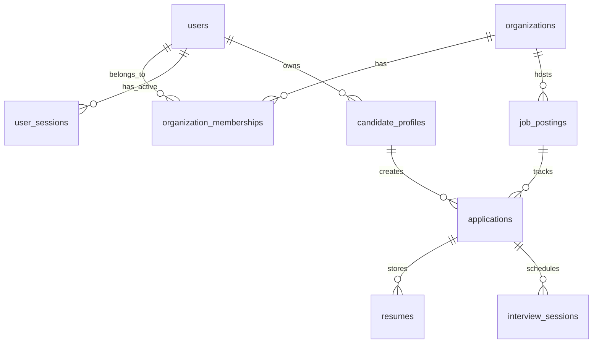

# Database Specifications & Schema Design

This document details the schema models, relations, and table designs built on PostgreSQL.

## Relational Entity Schema Mappings

The primary database structures map candidate profiles, interview intelligence metrics, and auditing details.

---

## 1. User Identity (`users`)

Stores user account data. Passwords are encrypted using the Argon2id hash algorithm.

| Column | Type | Constraints | Description |
| --- | --- | --- | --- |
| `id` | `uuid` | Primary Key | Unique user record identifier. |
| `email` | `varchar(255)` | Unique, Not Null | Account registration email address. |
| `password_hash` | `text` | Not Null | Argon2id secure hash block. |
| `first_name` | `varchar(100)` | Not Null | First name. |
| `last_name` | `varchar(100)` | Not Null | Last name. |
| `is_active` | `boolean` | Default `true` | Account suspension status indicator. |
| `created_at` | `timestamp` | Default `utcnow` | Creation timestamp. |

---

## 2. Candidate Profiles (`candidate_profiles`)

Extended profile data for candidate users.

| Column | Type | Constraints | Description |
| --- | --- | --- | --- |
| `id` | `uuid` | Primary Key | Profile record identifier. |
| `user_id` | `uuid` | FK (`users.id`) | Foreign key linking to base identity record. |
| `phone_number` | `varchar(50)` | Nullable | Contact number. |
| `created_at` | `timestamp` | Default `utcnow` | Creation timestamp. |

---

## 3. Resume Files (`resumes`)

Stores candidate uploaded CV tracking links and processing statuses.

| Column | Type | Constraints | Description |
| --- | --- | --- | --- |
| `id` | `uuid` | Primary Key | Resume record identifier. |
| `organization_id` | `uuid` | FK (`organizations.id`) | Tenant ID mapping. |
| `candidate_id` | `uuid` | FK (`candidate_profiles.id`) | Profile mapping owner. |
| `file_name` | `varchar(255)` | Not Null | Name of uploaded document. |
| `s3_key` | `varchar(500)` | Not Null | MinIO/S3 object storage location locator. |
| `file_size_bytes` | `integer` | Not Null | Size of document file. |
| `processing_status` | `varchar(50)` | Default `uploaded` | Extraction status (`uploaded`, `parsed`, `failed`). |
| `created_at` | `timestamp` | Default `utcnow` | Upload timestamp. |
