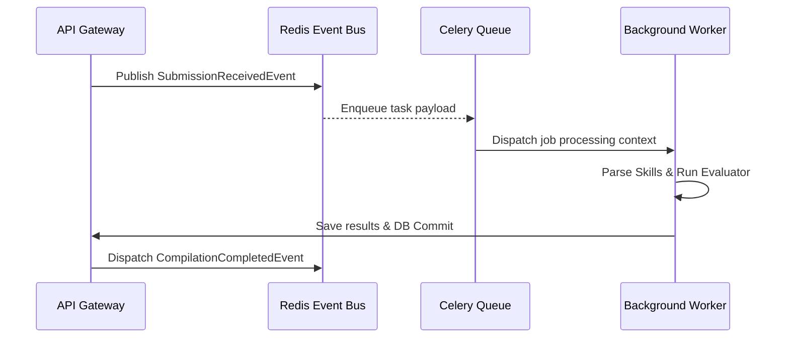
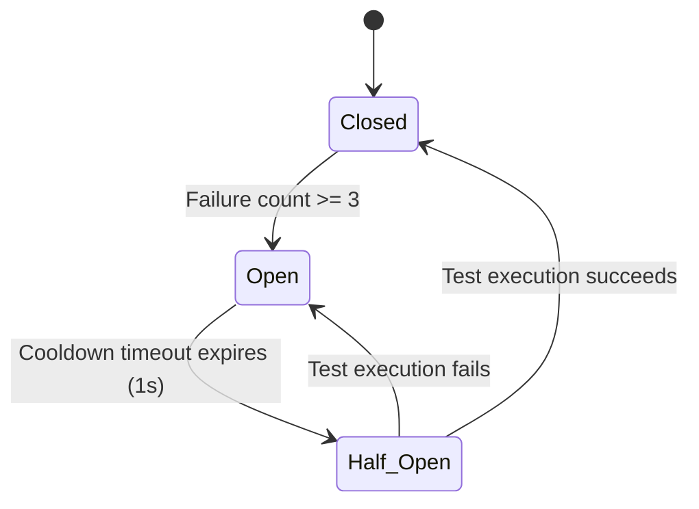

# System Design & Architecture Detail

This document outlines the design patterns, event flows, and resilience structures implemented in the HireMind AI platform.

## Event-Driven Core (Redis Event Bus)

The platform utilizes a structured Pub/Sub event bus powered by Redis to handle complex, decoupled multi-agent workflows.



### Event Manifest Contracts:
1. **SubmissionReceivedEvent:** Dispatched when code compilation is requested.
2. **CompilationCompletedEvent:** Dispatched when sandbox compiler outputs log streams.
3. **ExecutionCompletedEvent:** Dispatched when unit test assertion blocks finish executions.
4. **PlagiarismAnalysisCompletedEvent:** Emitted after code similarity comparisons complete.

---

## Resilience Engine (Circuit Breakers & Bulkheads)

The platform employs structural safety patterns (defined in `libs/telemetry/src/resilience.py`) to handle downstream AI completions, database failures, and network timeouts.

### 1. Circuit Breaker State Transition
Prevents cascading failures by stopping executions if external APIs (like Gemini or OpenAI) time out:



### 2. Bulkhead Semaphores
Limits concurrent calls on specific services (e.g. limit to 2 simultaneous OpenAI model queries) to prevent connection saturation:
```python
# Concurrency Semaphore allocation per external endpoint
BulkheadManager.execute("openai-endpoint", concurrency_limit=2, task_fn=concurrent_task)
```

### 3. Jitter Retry Backoff
Executes operations with random time delays between retry intervals to prevent "thundering herd" bottlenecks:
```python
delay = base_delay_seconds * (backoff_factor ** attempt) + random.uniform(0, 0.1 * delay)
```
