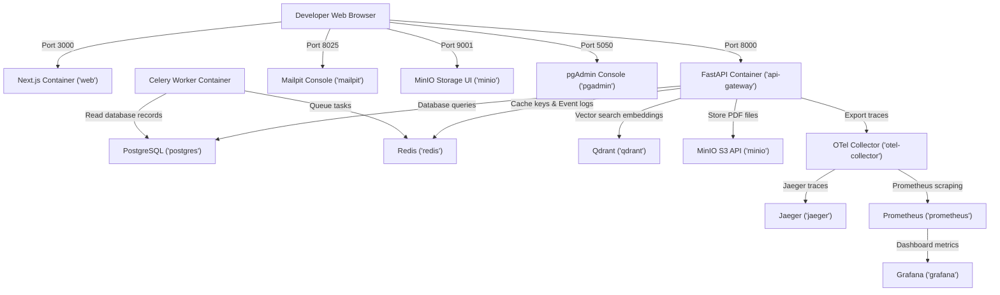

# Local System Architecture

This document describes the routing topology for our localhost containers setup.

```mermaid
graph TD
    User["Developer Web Browser"] -->|Port 3000| NextJS["Next.js Container ('web')"]
    User -->|Port 8000| Gateway["FastAPI Container ('api-gateway')"]
    User -->|Port 8025| Mailpit["Mailpit Console ('mailpit')"]
    User -->|Port 9001| MinIOConsole["MinIO Storage UI ('minio')"]
    User -->|Port 5050| pgAdmin["pgAdmin Console ('pgadmin')"]

    Gateway -->|Database queries| PG["PostgreSQL ('postgres')"]
    Gateway -->|Cache keys & Event logs| Redis["Redis ('redis')"]
    Gateway -->|Vector search embeddings| Qdrant["Qdrant ('qdrant')"]
    Gateway -->|Store PDF files| MinIO["MinIO S3 API ('minio')"]
    Gateway -->|Export traces| OTEL["OTel Collector ('otel-collector')"]

    Celery["Celery Worker Container"] -->|Queue tasks| Redis
    Celery -->|Read database records| PG

    OTEL -->|Jaeger traces| Jaeger["Jaeger ('jaeger')"]
    OTEL -->|Prometheus scraping| Prom["Prometheus ('prometheus')"]
    Prom -->|Dashboard metrics| Grafana["Grafana ('grafana')"]
```
