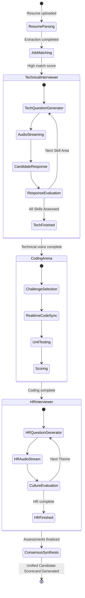

# HireMind AI: System Architecture & Agent Design

This document details the system architecture, media pipeline flow, and autonomous multi-agent orchestration design of HireMind AI.

---

## 1. High-Level Architecture Components

The application is structured as a **modular monorepo** consisting of three primary operational services, a sandboxed runner, and shared internal library dependencies.

### Core Architecture Layers

```
                               ┌────────────────────────┐
                               │       Web UI           │
                               │  (Next.js 15 Client)   │
                               └────┬──────────────┬────┘
                                    │              │
                    WebSocket/REST  │              │ WebRTC Audio
                                    ▼              ▼
                       ┌────────────────┐   ┌────────────────┐
                       │  API Gateway   │   │ WebRTC Server  │
                       │ (FastAPI App)  │   │  (Signaling)   │
                       └────────┬───────┘   └──────┬─────────┘
                                │                  │
                        ┌───────▼──────────────────▼────────┐
                        │      Agent Orchestrator           │
                        │    (LangGraph Engine / LLM)       │
                        └───────┬──────────────────┬────────┘
                                │                  │
                        ┌───────▼────────┐   ┌─────▼────────┐
                        │ Sandbox Runner │   │ Data Layer   │
                        │ (Isolated Env) │   │ (Postgres/   │
                        └────────────────┘   │  Qdrant/S3)  │
                                             └──────────────┘
```

### 1.1 Ingress & Routing (API Gateway)
- Implemented in FastAPI.
- Manages routing, rate-limiting, CORS checks, security headers, and tenant-scoping middleware.
- Extracts JWT headers and assigns the validated `tenant_id` to the request execution context.

### 1.2 WebRTC Signaling Server
- Facilitates network connection setup (ICE candidates exchange, SDP negotiation) between candidates and the Voice Engine.
- Once established, the signaling server handles fallback messaging and metadata transport during voice sessions.

### 1.3 Agent Orchestration Service (LangGraph Backend)
- Executes stateful workflows.
- Contains the decision logic, session transcripts, dynamic question structures, and LLM orchestration loop.
- Interacts with storage layers (SQLAlchemy, Redis) to retrieve candidate and role context.

### 1.4 Sandboxed Executor (Isolated Execution Environment)
- Runs untrusted candidate code inside temporary micro-containers (or Wasm runtime).
- Limits resources: `Max CPU: 0.5 Core`, `Max Memory: 128MB`, `Max Timeout: 5000ms`, `Network: Disabled`.
- Communicates execution results (standard output, stack trace, CPU/Memory runtime metrics) back to the caller.

---

## 2. Multi-Agent Orchestration Flow (LangGraph Engine)

The system deploys specialized autonomous agents executing within a shared state graph. The state defines the current progression, transcript context, code challenges, and scorecards.



### 2.1 Agent State Definition (Pydantic Schema)
The orchestration graph relies on a shared state variable passed between execution nodes:
```python
from pydantic import BaseModel, Field
from typing import List, Dict, Any, Optional

class CandidateState(BaseModel):
    candidate_id: str
    job_id: str
    tenant_id: str
    resume_metadata: Dict[str, Any] = Field(default_factory=dict)
    current_stage: str = "screening"
    current_node: str = "sourcing"
    skills_to_evaluate: List[str] = Field(default_factory=list)
    completed_skills: List[str] = Field(default_factory=list)
    current_question: Optional[str] = None
    voice_transcript: List[Dict[str, str]] = Field(default_factory=list)
    coding_challenge_id: Optional[str] = None
    code_submission: Optional[str] = None
    sandbox_results: Dict[str, Any] = Field(default_factory=dict)
    telemetry_logs: List[Dict[str, Any]] = Field(default_factory=list)
    individual_agent_feedback: Dict[str, Any] = Field(default_factory=dict)
    consolidated_scorecard: Dict[str, Any] = Field(default_factory=dict)
```

---

## 3. WebRTC Audio Streaming Architecture

To maintain an end-to-end voice loop under **1000ms**, processing steps are pipelined concurrently:

```
[Candidate Mic] 
      │ 
      ▼ (Real-time Audio Stream via WebRTC over UDP)
[WebRTC Server Gateway] 
      │ 
      ▼ (Audio Chunks 100-200ms)
[Voice Activity Detector (VAD)] 
      │ 
      ├──► Silence Detected -> Send buffer to Whisper (STT) 
      ▼ 
[Whisper API / Faster-Whisper local] 
      │ 
      ▼ (Text Transcript String)
[LangGraph Agent Node Inference] (GPT-4o or Gemini 1.5 Pro Streaming)
      │ 
      ▼ (Text Stream Output Chunks)
[ElevenLabs / Deepgram TTS API] 
      │ 
      ▼ (Synthesized Audio Chunks)
[WebRTC Stream Player] 
      │ 
      ▼ (Audio Output)
[Candidate Speakers]
```

### Performance Optimizations
1. **TTS Streaming:** Rather than waiting for the entire LLM response sentence to finish, text chunks are routed to the Text-to-Speech engine as soon as punctuation markers (e.g. `.`, `,`, `?`) are identified.
2. **Dynamic Interrupt Check:** If the Voice Activity Detector (VAD) registers candidate speaking events while the AI agent is playing audio, the AI audio output stream is immediately canceled on the WebRTC media track to mimic natural conversation dynamics.
